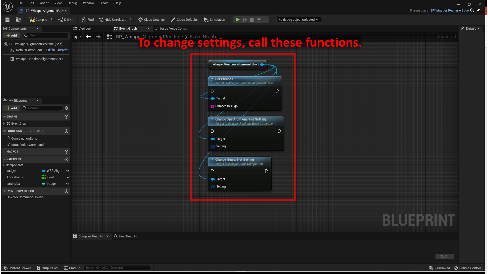

# Alignment for short phrases

See `Plugins > WhisperRealtime > Sample > BP > Alignment_Short > BP_WhisperAlignmentRealtime` for a sample implementation.  
You can test it in sample map located at `Plugins > WhisperRealtime > Sample > Map > test_AlignmentShort`.

## Basic setup 

1. Create an actor blueprint.
2. Add `Whisper Realtime Alignment Short` component.
3. Set the default Neural Net settings:
	- See [How to use - Transcription](../how-to-use-transcript) page for the details.
4. Set the default alignment settings:
	- Specify `Phrases to Align`.
	- Specify `Prohibited letters` if you want to remove certain letters from the phrases.
	    - This is a simple feature just for removing symbols from the phrases. It is recommended that symbols such as "" (double quotation) are not included in the phrases, because they are not actually pronounced in the speech.
5. Get results from `On Speaking` event and `On Spoken` event.
	- These events provide an array of `Alignment Short Result`. The elements of the array hold the phrase index and the probability of being spoken. The array is sorted in order of probability of being spoken.
	- See [How to use - Transcription](../how-to-use-transcript) page for the difference of `On Speaking` and `On Spoken` events.

    { loading=lazy }  

## Check thresholds to trigger specific events

See `Issue Voice Command` function of `Plugins > WhisperRealtime > Sample > BP > Alignment_Short > BP_WhisperAlignmentRealtime` for a sample implementation.

This function demonstrates:

- How to check the probabilities
- How to avoid the same event being called repeatedly while the user is speaking
- How to accept the next voice command immediately after one is accepted

    { loading=lazy }  

## Change settings

- To change `Phrases to Align`, call `Set Phrases` function.
- To change Audio Input Spectrum Analysis settings, call `Change Spectrum Analysis Setting` function.
- To change Neural Net settings, call `Change Neural Net Setting` function.

    { loading=lazy }  
