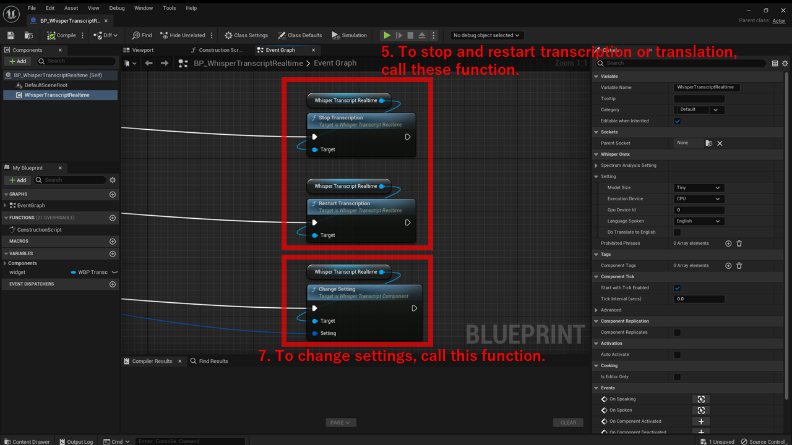

# How to use

!!! Note
	There is an example BP at `Plugins > WhisperRealtime > Sample > BP > BP_WhisperTranscriptRealtime`.  
	You can test it in sample map located at `Plugins > WhisperRealtime > Sample > Map > test_transcript`.

1. Create an actor blueprint.
2. Add `Whisper Transcript Realtime` component.
3. Set the default settings:
	- Specify `Model Size`. The larger the model, higher the accuracy and the CPU/GPU/memory usage.
	- Specify `Execution device`, whether to use CPU or GPU.
	- Specify `GPU Device ID` if you use GPU and you have multiple GPUs in your PC.
	- Specify `Language spoken`.
	- Specify `Do Translate to English`. If you just want to transcribe speech to text in the language specified above, leave unchecked.
	- Specify `Prohibited Phrases` if you want to suppress certain phrases.
	    - Note that this feature simply removes the specified phrases from the result. If you specify a short phrase, for example `at`, the phrase will be removed from all words (e.g. `that` becomes `th`).
4. Get results from `On Speaking` event and `On Spoken` event.
	- `On Speaking` event gives intermidiate result while the user is still speaking.
	- `On Spoken` event gives the final result after the user stops speaking.

    { loading=lazy }  

5. To stop transcription or translation, call `Stop Transcription` function of `Whisper Transcript Realtime` component.
6. To restart transcription or translation, call `Restart Transcription` function of `Whisper Transcript Realtime` component.
7. To change settings, call `Change Setting` function of `Whisper Transcript Realtime` component.

    { loading=lazy }  
