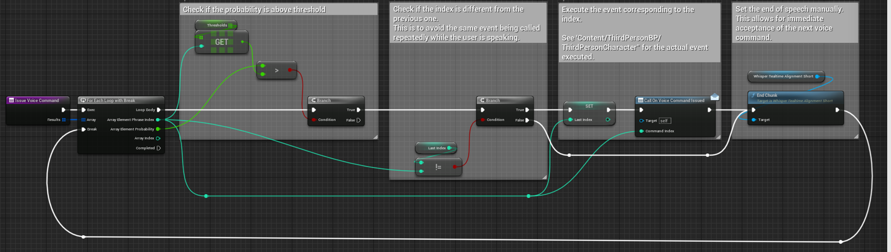

# 短いフレーズに対するアライメント

指定した複数の短いフレーズについて、それぞれが発話されたかどうかのスコアを返す機能です。

サンプル実装は、`Plugins > WhisperRealtime > Sample > BP > Alignment_Short > BP_WhisperAlignmentRealtime`にあります。  
`Plugins > WhisperRealtime > Sample > Map > test_AlignmentShort`のマップでテストできます。

## 基本的なセットアップ
1. アクターBlueprintを作成します
2. `Whisper Realtime Alignment Short`コンポーネントを追加します
3. ニューラルネットワーク設定（Neural Net settings）と音声入力・スペクトル分析設定（Audio Input Spectrum Analysis settings）のデフォルト値を設定します:
	- 詳細は、[使い方 - 文字起こし](../how-to-use-transcript)ページを参照してください。
4. アライメント設定のデフォルト値を設定します:
	- `Phrases to Align`：アライメント対象の文字列を指定します。
	- `Prohibited letters`：アライメント対象の文字列から一定の文字を削除したい場合に指定します。
	    - これは、フレーズから記号を取り除くためだけのシンプルな機能です。例えば、""（ダブルクォーテーション）などの記号は、実際には発音されないので、アライメント対象のフレーズに含めないことをお勧めします。
5. イベント「On Speaking」と「On Spoken」から結果を取得します。
	- これらのイベントは、`Alignment Short Result`の配列を提供します。配列の要素には、フレーズ番号と発話された確率が格納されています。また、配列は、発話された確率の高い順にソートされています。
	- `On Speaking`と`On Spoken`の違いは、[使い方 - 文字起こし](../how-to-use-transcript)ページを参照してください。

    { loading=lazy }  

## 特定イベントを実行する

実装例として、`Plugins > WhisperRealtime > Sample > BP > Alignment_Short > BP_WhisperAlignmentRealtime` の `Issue Voice Command` 関数を参照してください。

この関数は

- 各フレーズが話された確率を確認する方法
- ユーザーが話している間、同じイベントが繰り返し呼び出されないようにする方法
- 音声コマンドを受け付けた後、すぐに次の音声コマンドを受け付ける方法

の例となっています。

  { loading=lazy }  

## 設定の変更

- アライメント対象の文字列`Phrases to Align`を変更するには、`Set Phrases`関数を呼び出します。
- 音声入力・スペクトル分析設定を変更するには、`Change Spectrum Analysis Setting`関数を呼び出します。
- ニューラルネットワーク設定を変更するには、`Change Neural Net Setting`関数を呼び出します。

    { loading=lazy }  
