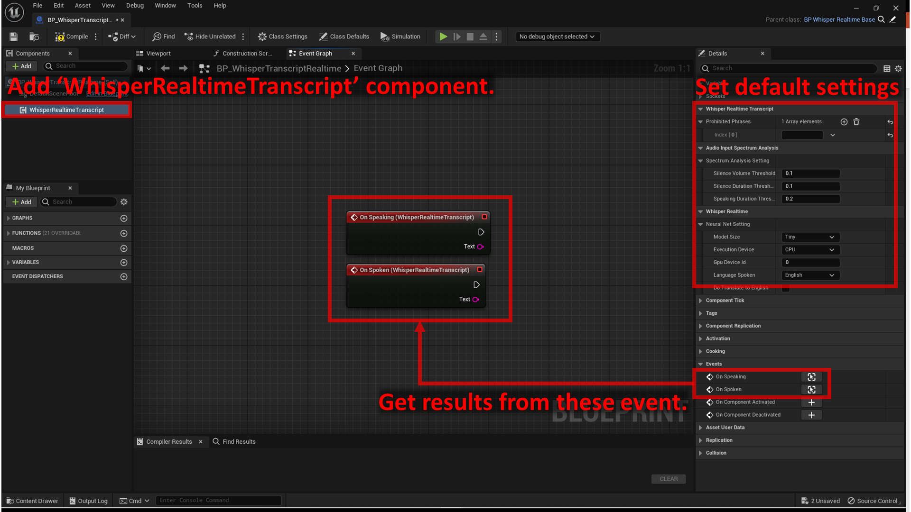

# 文字起こし

サンプル実装は、`Plugins > WhisperRealtime > Sample > BP > Transcript > BP_WhisperTranscriptRealtime`にあります。  
`Plugins > WhisperRealtime > Sample > Map > test_Transcript`のマップでテストできます。

## 基本的なセットアップ

1. アクターBlueprintを作成します
2. `Whisper Realtime Transcript`コンポーネントを追加します
3. ニューラルネットワーク設定（Neural Net settings）のデフォルト値を設定します:
	- `Model Size`：使用する機械学習モデルのサイズを指定します。モデルが大きくなるほど、精度が上がり、CPU/GPU/メモリの使用量も増えます。

		??? Question "Largeモデルは？"
			Whisperの公式実装では、一番大きいモデルサイズとして「Large」が提供されていますが、このプラグインにはLargeモデルは含まれていません。  
			なぜなら、ゲーム用途として大きすぎ、プラグイン開発者の開発環境で正常に動作させることができなかったためです。

	- `Execution device`： CPUとGPUのどちらを使うかを指定します。
	- `GPU Device ID`：GPUを使用し、PCに複数のGPUを搭載している場合、使用するGPUの番号を指定します。
	- `Language spoken`：実際に話す言語を指定します。
	- `Do Translate to English`：上記で指定した言語で音声をテキストに変換するのであれば、チェックを外したままにします。

3. 音声入力・スペクトル分析設定（Audio Input Spectrum Analysis settings）のデフォルト値を設定します:
	- `Silence Volume Threshold`：無音状態を判定するための音量の閾値を指定します。
		マイクの最大入力は1.0。完全な無音は0.0です。
	- `Silence Duration Threshold`：無音状態を判断するための時間の閾値を秒単位で指定します。
		`Silence Volume Threshold`以下の音量がこの時間続くと、発話状態から無音状態へ遷移します。
	- `Silence Speaking Threshold`：発話状態を判断するための時間の閾値を秒単位で指定します。
		`Silence Volume Threshold`以上の音量がこの時間続くと、無音状態から発話状態へ遷移します。

4. 文字起こし設定のデフォルト値を設定します:
	- `Prohibited Phrases`：特定のフレーズを禁止したい場合に指定します。
	    - この機能は、単に指定されたフレーズを結果から削除するだけであることに注意してください。例えば `at` のような短いフレーズを指定すると、すべての単語からそのフレーズが削除されます（例えば `that` は `th` になります）。

5. イベント「On Speaking」と「On Spoken」から結果を取得します。

	- `On Speaking` イベントは、ユーザが発話中の、中間的な結果を提供します。
	- `On Spoken` イベントは、ユーザが話すのを止めた後に、最終的な結果を提供します。

	!!! Warning
		`On Speaking`の結果の末尾は、発話の途中で音声がぶった切られているため、正しくない結果になりがちでありことに注意してください。

	!!! Info
		ユーザーが発話中かどうかを判断するために音声入力スペクトル解析の設定値が使用されます。

    { loading=lazy }  

## 設定の変更

- 音声入力・スペクトル分析設定を変更するには、`Change Spectrum Analysis Setting`関数を呼び出します。
- ニューラルネットワーク設定を変更するには、`Change Neural Net Setting`関数を呼び出します。

	{ loading=lazy }  

## 停止と再開

- 音声認識を停止するには、`Stop Mic Input` 関数を呼び出します。
- 音声認識を再開するには、`Restart Mic Input` 関数を呼び出します。